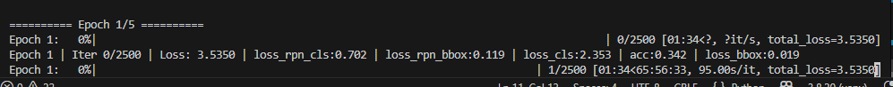
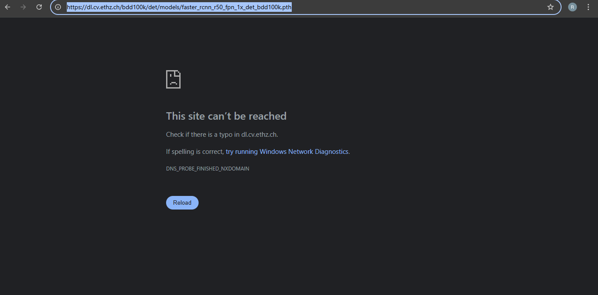

# Road Sense Project

Road Sense is an end-to-end object detection project based on the BDD100K Dataset.  
This repository contains solutions for two major parts of the assignment:

- Data Analysis (10 Points) – Completed End-to-End  
- Model Building & Training (5 + 5 Points)

The project follows clean coding practices (PEP8), proper documentation, modular structure, and containerized execution for reproducibility.

---

## Repository Structure

Road_Sense/

Data_Analysis/  
- README.md  
- src/  
- docker/  
- dashboard/  
- reports/  

Model/  
- README.md  
- build_model.py  
- fine_tune.py  
- inference.py  
- configs/  
- notebooks/  

README.md (this file)

Each folder contains its own detailed README explaining implementation details.

---

## 1. Data Analysis (Completed End-to-End)

Folder: `Data_Analysis/`  
  
Detailed documentation, implementation, dataset insights, and execution instructions are available in:

[Bdd_Analysis_question1/README.md](./Bdd_Analysis_question1/README.md)


## 2. Model Building & Training

**Folder:** `Model/`

This stage focuses on building and fine-tuning object detection models using MMDetection.

---
[Eval_and_Train_question2/README.md](./Eval_and_Train_question2/README.md)


## 3. Training Limitation

Training was attempted locally but:

- 5 epochs took approximately 65 hours  

**System specification:**

- Machine Type: 64-bit CPU Machine  
- No dedicated GPU  

Due to hardware limitations, fine tuning was not feasible.

#### Proof of Training Attempt


---

## 4. Attempt with Google Colab

Training was attempted using Google Colab.

**Issue faced:**

Latest Colab Torch versions are incompatible with the MMDetection version used.

This caused:

- CUDA errors  
- Dependency conflicts  
- Version mismatch failures  

As a result, remote training was not successful.

---

## 5. Issues Faced During Assignment

### Pretrained Weight Link Not Working

Some official model zoo weight links were not accessible.

[weight_link](https://dl.cv.ethz.ch/bdd100k/det/models/faster_rcnn_r50_fpn_1x_det_bdd100k.pth)



### Training Time Constraint

CPU-only training was extremely slow (65 hours for 5 epochs).

### Colab Version Compatibility

Torch version mismatch with MMDetection.

---

## What Was Successfully Achieved

- Full Data Analysis with insights  
- Dockerized reproducible analysis  
- Model building pipeline implemented  
- Inference pipeline created  
- Fine-tuning script built  
- Config-driven architecture  
- Clean and modular code  
- PEP8 compliant  
- Proper documentation  

---

## Coding Standards

- Followed PEP8  
- Used:
  - black  
  - pylint  
- Proper docstrings for classes and functions  
- Modular code structure  

---

## How to Run

### Data Analysis

```bash
cd Data_Analysis
docker build -t road_sense_analysis .
docker run road_sense_analysis

```

## Model Inference

```bash
cd Model
python inference.py --config configs/model_config.py --image path/to/image.jpg

```
## Author

Raj Gaurav Tiwari 

---

## Final Note

This repository demonstrates:

- Strong understanding of dataset analysis  
- Ability to derive insights from large-scale datasets  
- Experience working with modern detection frameworks  
- Config-driven deep learning pipelines  
- Containerization skills  
- Practical problem solving under hardware constraints  
